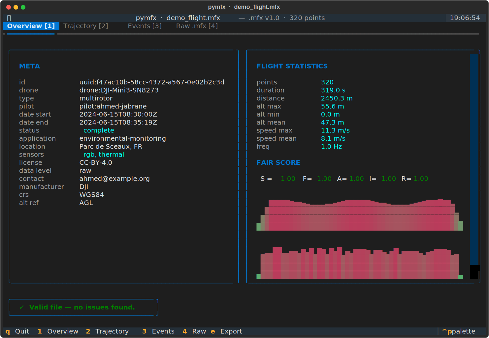
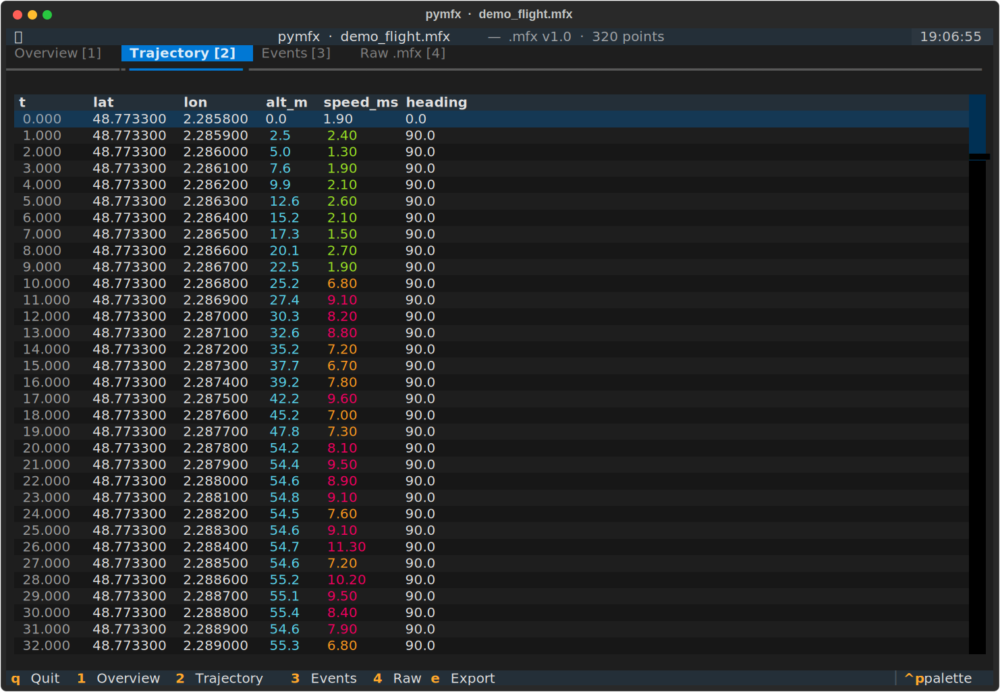

# pymfx

[](https://github.com/jabahm/pymfx/actions/workflows/ci.yml)
[](https://pypi.org/project/pymfx/)
[](https://codecov.io/gh/jabahm/pymfx)
[](https://jabahm.github.io/pymfx)

Parse, validate, analyse and convert UAV mission data using the open [`.mfx`](https://github.com/jabahm/pymfx) format — plain text, self-describing, FAIR-compliant, single file per flight.

```bash
pip install pymfx
```

---

## Package

```python
import pymfx

mfx = pymfx.parse("flight.mfx")
pymfx.validate(mfx)
```

| Function | Description |
|---|---|
| `parse(src)` | Parse a `.mfx` file or string |
| `validate(mfx)` | Run V01–V21 validation rules |
| `flight_stats(mfx)` | Duration, distance, alt, speed |
| `fair_score(mfx)` | FAIR compliance score (F/A/I/R) |
| `detect_anomalies(mfx)` | Speed spikes, GPS jumps, altitude cliffs |
| `write(mfx, dest)` | Write with auto SHA-256 checksum |

**Convert**

```python
mfx = pymfx.convert.from_gpx("track.gpx")
pymfx.convert.to_geojson(mfx)
```

| | Import | Export |
|---|---|---|
| GPX 1.1 | `from_gpx` | `to_gpx` |
| GeoJSON | `from_geojson` | `to_geojson` |
| CSV | `from_csv` | `to_csv` |
| DJI / AirData | `from_dji_csv` | |
| KML | | `to_kml` |

**Visualize**

```python
import pymfx.viz as viz
viz.flight_profile(mfx)
```

| Function | Output |
|---|---|
| `trajectory_map(mfx)` | Folium map, speed gradient |
| `speed_heatmap(mfx)` | Folium map, heat overlay |
| `compare_map([...])` | Multi-flight overlay |
| `flight_profile(mfx)` | Alt / speed / heading chart |
| `flight_3d(mfx)` | 3D trajectory |
| `events_timeline(mfx)` | Events on flight axis |


**DataFrame**

```python
df = mfx.trajectory.to_dataframe(events=mfx.events)
```

---

## TUI

```bash
pymfx flight.mfx --tui
```



| Key | Tab |
|---|---|
| `1` | Overview |
| `2` | Trajectory |
| `3` | Events |
| `4` | Statistics + FAIR |
| `5` | Anomalies |
| `6` | Raw |
| `e` | Export |



---

## CLI

```bash
pymfx flight.mfx --validate
```

| Flag | Action |
|---|---|
| `--validate` | Check V01–V21 rules |
| `--info` | File summary |
| `--stats` | Flight statistics |
| `--checksum` | Verify SHA-256 |
| `--anomalies` | Detect anomalies |
| `--diff other.mfx` | Compare two files |
| `--export fmt -o out` | Export to gpx/kml/csv/geojson |
| `--import fmt -o out` | Import from gpx/csv/dji/geojson |
| `--repair -o out` | Rebuild checksum + index |
| `--tui` | Open interactive viewer |

---

## Format

```
@mfx 1.0
@encoding UTF-8

[meta]
id         : uuid:f47ac10b-58cc-4372-a567-0e02b2c3d479
drone_id   : drone:DJI-Mini3-SN8273
pilot_id   : pilot:ahmed-jabrane
date_start : 2025-06-15T08:30:00Z
status     : complete
license    : CC-BY-4.0

[trajectory]
frequency_hz : 1.0
@checksum sha256:b1f2bc...
@schema point: {t:float [no_null], lat:float [no_null], lon:float [no_null], alt_m:float32, speed_ms:float32}
data[]:
0.000 | 48.7733 | 2.2858 | 52.1 | 3.2
1.000 | 48.7734 | 2.2859 | 54.3 | 4.1

[index]
bbox      : (2.2858, 48.7733, 2.2901, 48.7751)
anomalies : 0
```

---

## License

MIT
