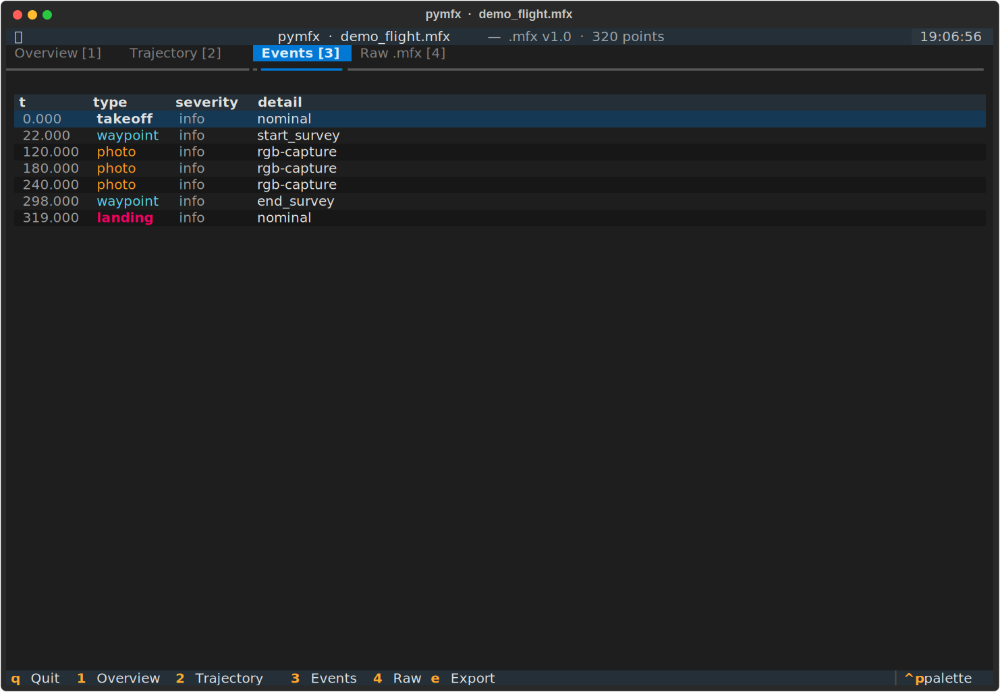

# pymfx

[](https://github.com/jabahm/pymfx/actions/workflows/ci.yml)
[](https://pypi.org/project/pymfx/)
[](https://codecov.io/gh/jabahm/pymfx)
[](https://jabahm.github.io/pymfx)
[](https://github.com/jabahm/pymfx)

Python library for the **Mission Flight Exchange** (`.mfx`) format — an open plain-text format for UAV mission data built for [FAIR](https://www.go-fair.org/fair-principles/) compliance.

```bash
pip install pymfx            # core (zero runtime dependencies)
pip install pymfx[viz]       # + folium maps & matplotlib plots
pip install pymfx[ds]        # + pandas DataFrame integration
pip install pymfx[tui]       # + interactive terminal viewer
```

---

## Package

Parse, validate, score, detect anomalies and write `.mfx` files from Python — zero runtime dependencies.

```python
import pymfx

mfx = pymfx.parse("flight.mfx")

# Validate (V01–V21 rules)
result = pymfx.validate(mfx)
print(result)
# ✓ Valid file - no issues found.

# Flight statistics
stats = pymfx.flight_stats(mfx)
print(stats)
# Points: 320  Duration: 319.0 s  Distance: 2 450 m
# Alt  max/min/mean: 55.6 / 0.0 / 47.3 m
# Speed max/mean:    11.3 / 8.1 m/s

# FAIR compliance score
score = pymfx.fair_score(mfx)
print(f"S = {score.S:.2f}  (F={score.F:.2f} A={score.A:.2f} I={score.interop:.2f} R={score.R:.2f})")
# S = 1.00  (F=1.00 A=1.00 I=1.00 R=1.00)

# Anomaly detection
report = pymfx.detect_anomalies(mfx)
print(report)
# 2 anomaly(ies) found
#   t=42.000  speed_spike   warning   Z=4.12 (8× above mean)
#   t=87.000  altitude_cliff  warning  Δalt/Δt=32.1 m/s

# Write back (auto-computes SHA-256 checksums)
pymfx.write(mfx, "out.mfx")
```

### Convert

```python
# Import from common formats
mfx = pymfx.convert.from_dji_csv("DJIFlightRecord.csv")   # AirData or DJI Fly
mfx = pymfx.convert.from_gpx("track.gpx")
mfx = pymfx.convert.from_geojson("route.geojson")
mfx = pymfx.convert.from_csv("points.csv")

# Export
pymfx.convert.to_geojson(mfx)    # → GeoJSON FeatureCollection
pymfx.convert.to_gpx(mfx)        # → GPX 1.1
pymfx.convert.to_kml(mfx)        # → KML (Google Earth)
pymfx.convert.to_csv(mfx)        # → CSV
```

### Visualize (`pymfx[viz]`)

```python
import pymfx.viz as viz

viz.trajectory_map(mfx)        # interactive folium map (speed gradient)
viz.speed_heatmap(mfx)         # map coloured by speed
viz.compare_map([mfx1, mfx2])  # multi-flight overlay
viz.flight_profile(mfx)        # altitude / speed / heading over time
viz.flight_3d(mfx)             # 3-D lat/lon/alt trajectory
viz.events_timeline(mfx)       # events on the flight timeline
```


### DataFrame (`pymfx[ds]`)

```python
df = mfx.trajectory.to_dataframe(events=mfx.events)
```
```
      t      lat     lon   alt_m  speed_ms  event_type
    0.0  48.7733  2.2858     0.0       1.9     takeoff
    1.0  48.7733  2.2859     2.5       2.4     takeoff
   22.0  48.7733  2.2880    54.6       8.9    waypoint
  120.0  48.7739  2.2898    48.3       9.3       photo
  319.0  48.7733  2.2858     0.0       1.2     landing
```

---

## TUI

An interactive terminal viewer for `.mfx` files. Explore meta, trajectory, events, statistics, anomalies and raw source — all from the keyboard.

```bash
pip install pymfx[tui]
pymfx flight.mfx --tui
```

Six tabs, all keyboard-driven:

| Key | Tab |
|-----|-----|
| `1` | **Overview** — meta fields, key stats, altitude & speed sparklines, validation status |
| `2` | **Trajectory** — full point table with speed colour gradient |
| `3` | **Events** — event log with type/severity colour coding |
| `4` | **Statistics** — full FlightStats (std dev, coverage %) + FAIR criterion breakdown |
| `5` | **Anomalies** — speed spikes, GPS jumps, altitude cliffs |
| `6` | **Raw** — source file with line numbers |
| `e` | **Export** — save as GeoJSON / GPX / KML / CSV |




---

## CLI

Single-command inspection directly from the terminal — no Python required after install.

```bash
# Validate against all V01–V21 rules
pymfx flight.mfx --validate
# ✓ Valid  —  0 errors, 2 warnings
#   ⚠ V11  altitude value 62.3 above recommended range
#   ⚠ V18  frequency gap detected at t=42.0 (> 20 % threshold)

# Flight summary
pymfx flight.mfx --info
# id       : uuid:f47ac10b-...
# drone    : DJI-Mini3-SN8273  (multirotor)
# pilot    : pilot:ahmed-jabrane
# date     : 2025-06-15T08:30:00Z
# status   : complete
# location : Parc de Sceaux, FR
# points   : 320   duration: 319.0 s

# Detailed statistics
pymfx flight.mfx --stats
# Points     : 320        Freq  : 1.0 Hz
# Duration   : 319.0 s    Dist  : 2450.3 m
# Alt  max   : 55.6 m     Speed max  : 11.3 m/s
# Alt  mean  : 47.3 m     Speed mean :  8.1 m/s

# Verify SHA-256 checksum
pymfx flight.mfx --checksum
# ✓ Checksum valid

# Detect anomalies (--output saves injected events)
pymfx flight.mfx --anomalies
pymfx flight.mfx --anomalies -o fixed.mfx

# Compare two flights
pymfx a.mfx --diff b.mfx

# Export to another format
pymfx flight.mfx --export geojson -o out.geojson
pymfx flight.mfx --export gpx     -o out.gpx
pymfx flight.mfx --export kml     -o out.kml
pymfx flight.mfx --export csv     -o out.csv

# Import from common formats
pymfx track.gpx  --import gpx     -o flight.mfx
pymfx log.csv    --import dji     -o flight.mfx
pymfx data.csv   --import csv     -o flight.mfx

# Repair (recompute checksum + rebuild index)
pymfx flight.mfx --repair -o fixed.mfx
```

---

## The .mfx format

Plain text, structured sections, human-readable and diff-friendly:

```
@mfx 1.0
@encoding UTF-8

[meta]
id            : uuid:f47ac10b-58cc-4372-a567-0e02b2c3d479
drone_id      : drone:DJI-Mini3-SN8273
drone_type    : multirotor
pilot_id      : pilot:ahmed-jabrane
date_start    : 2025-06-15T08:30:00Z
date_end      : 2025-06-15T08:35:19Z
status        : complete
application   : environmental-monitoring
location      : Parc de Sceaux, FR
sensors       : [rgb, thermal]
data_level    : raw
license       : CC-BY-4.0
contact       : ahmed@example.org

[trajectory]
frequency_hz  : 1.0
@checksum sha256:b1f2bc...
@schema point: {t:float [no_null], lat:float [no_null], lon:float [no_null], alt_m:float32, speed_ms:float32, heading:float32}
data[]:
0.000 | 48.7733 | 2.2858 | 52.1 | 3.2 | 182.0
1.000 | 48.7734 | 2.2859 | 54.3 | 4.1 | 183.0
...

[index]
bbox      : (2.2858, 48.7733, 2.2901, 48.7751)
anomalies : 0
```

---

## License

MIT · Format spec: CC BY 4.0
